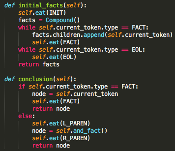
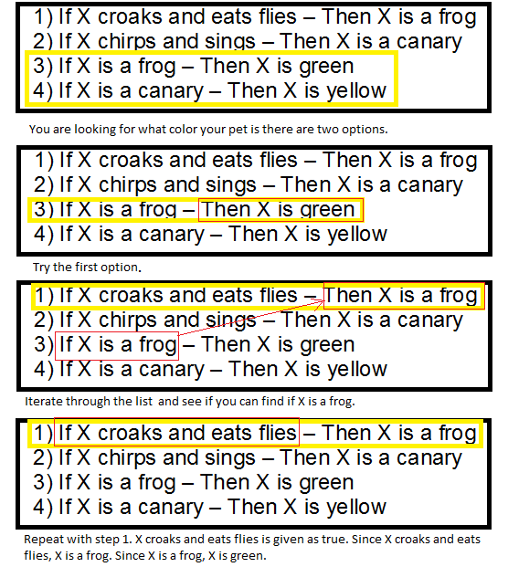

__The goal of this project was to make a propositional calculus expert system. Its an engine capable of understand rules and fact and answering questions based on these.__

__A simple example :__
```
The rules:
	A is True, B is False
	C is true if A or B are True

The Question:
	Is C True ? Yes !
```

__This Expert System was written in Python.__



__The questions are answered through a backward chaining inference engine. Which is a complicated way of saying that we start our resolution from the question and work backward towards facts.__


([Source](https://en.wikipedia.org/wiki/Backward_chaining))


[Subject](https://cdn.intra.42.fr/pdf/pdf/104/expertsystem.pdf)

[Index](/)
