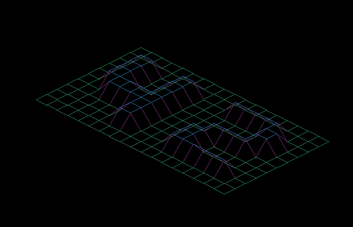
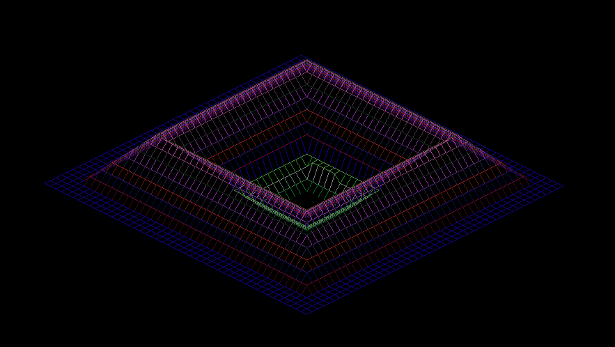
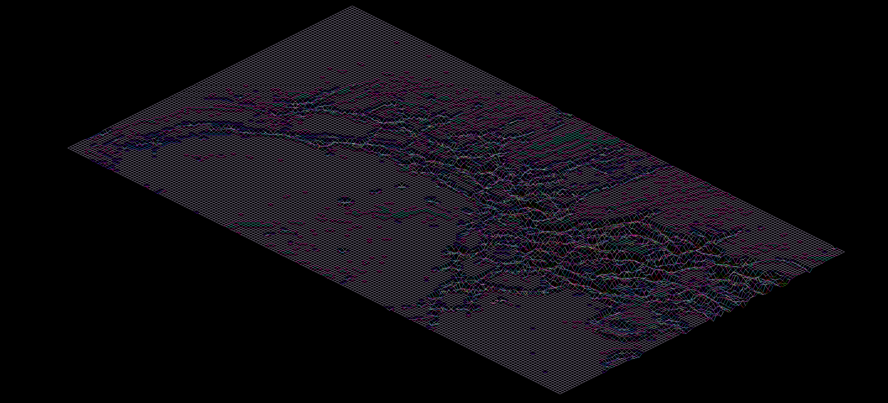
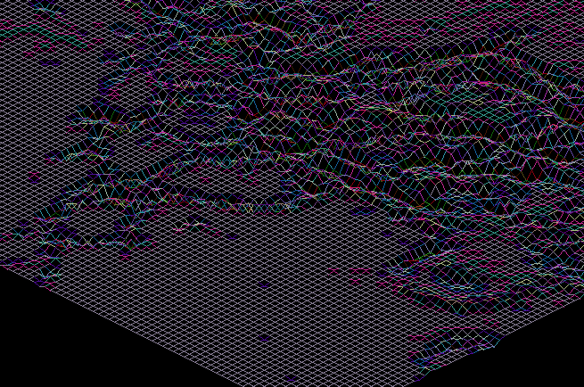

__This project is an introduction to graphic programming.
The goal is to create a simplified graphic "wireframe" representation
of a relief landscape, by linnking various points together.__



__The coordinates are stored in a file passed to the program.
the horizontal position of each value corresponds to its axis,
the vertical position corresponds to its ordinate and his value corresponds to its altitude.__

__This is the input given to produce the picture above.__
```
0   0   0   0   0   0   0   0   0   0   0   0   0   0   0   0
0   0   0   0   0   0   0   0   0   0   0   0   0   0   0   0
0  10  10   0   0  10  10   0   0  10  10  10  10  10   0   0
0  10  10   0   0  10  10   0   0   0   0   0   0  10  10   0
0  10  10   0   0  10  10   0   0   0   0   0   0  10  10   0
0  10  10  10  10  10  10   0   0   0  10  10  10  10   0   0
0   0  10  10  10  10  10   0   0  10  10   0   0   0   0   0
0   0   0   0   0  10  10   0   0  10  10   0   0   0   0   0
0   0   0   0   0  10  10   0   0  10  10  10  10  10  10   0
0   0   0   0   0   0   0   0   0   0   0   0   0   0   0   0
0   0   0   0   0   0   0   0   0   0   0   0   0   0   0   0
```

__I decided to add colors depending on the altitude, they are choosed randomly.
Two more examples :__






(zoomed in)


[Subject](https://cdn.intra.42.fr/pdf/pdf/881/fdf.en.pdf)