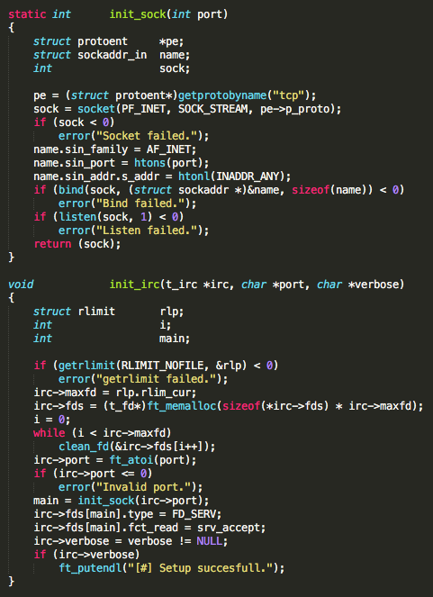
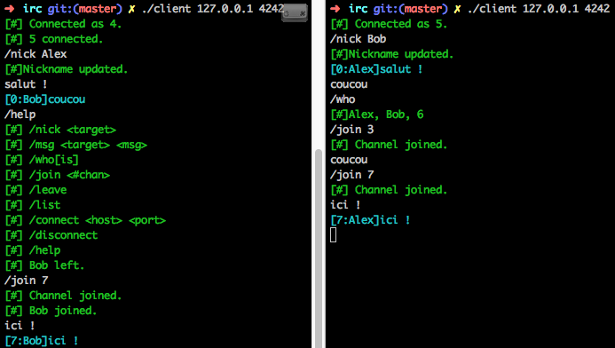
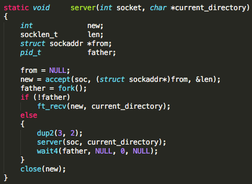

___IRC___

__The goal of this project was to implement an IRC client/server pair. IRC stands for Internet Relay Chat, which is a enables discussion between people accross internet.__

__It was written in C using unix sockets and listen.__

__The goal was to host multiple clients on a server, allowing them to discuss, change their names and browse different rooms as well as sending private message.__

[Subject](https://cdn.intra.42.fr/pdf/pdf/1098/ft_irc_20-02-2015.pdf)

___FT_P___

__Much like IRC, FTP is about implementing a way to send and recieve files accross a network.__

__Again it is written in C with unix's accept.__

[Subject](https://cdn.intra.42.fr/pdf/pdf/110/ft_p.pdf)

__Both of these projects were great examples of unix networking in C.__

[Index](/)