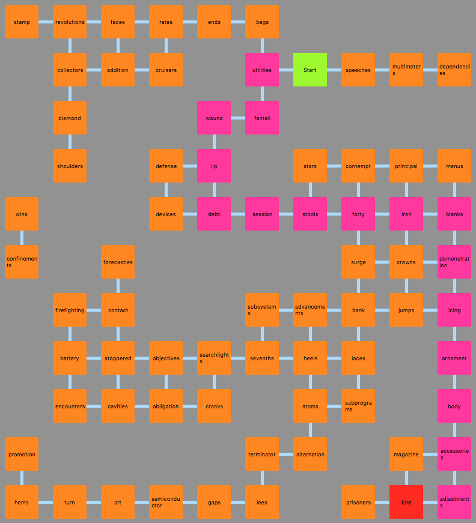

__This project is about pathfinding and to a lesser extent parsing. The goal is to find the quickest way to get ants across an anthill. The setup is passed as a file, decribeding the number of ants, each rooms and the links between them.__

__Lem_In was written in C with a GUI in Python with TKinter.__

__Multiple Pathfinding algorithms are used to find the best route for each ant considering the potential congestions.__

[Subject](https://cdn.intra.42.fr/pdf/pdf/185/lem-in.fr.pdf)

[Index](/)
